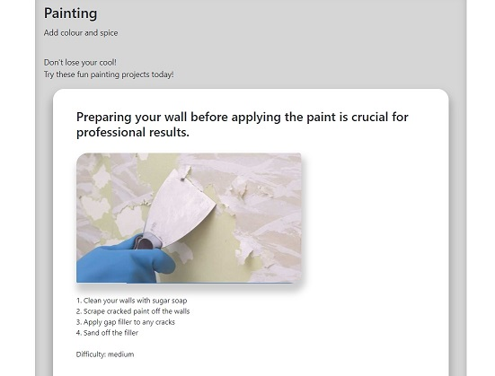
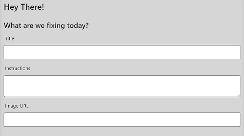
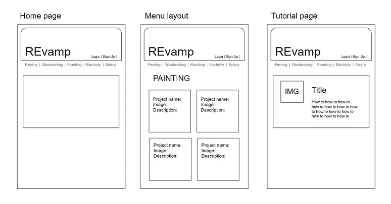

# REvamp Ver 1.0

   
  

Link: https://revampyourlife.herokuapp.com/ 
Repo: https://github.com/Brento20/revamp 
Support: https://nodemailer.com/about/   

## Table of Contents
[Project Description](#project-description)

[User Story](#User)

[Initial Concept](#initial-concept)

[File Structure](#file-structure)

<!-- HTML, [CSS stylesheet planning],javaScript. -->

[Usage](#file-structure)

[Future Development](#future-development)
  

## Project Description

REvamp is a web application designed to help empower people to repair, restore and improve the items in our lives that society has told us have become disposable.

Our users can see DIY projects by category that give them inspiration for their own life as well as contributing DIY instructions.

Developed in collaboration with:

Miguel Afable, Mona Mahmoud and Brenton Weaver.

 

## User Story
>
>**When I** arrive on the homepage, I can click on categories for DIY projects.
>
>**Then** I can click on the category, I'm shown a page with summaries of each project available.
>
>**When I** click a project, I see the full method of how to complete the DIY.
>
>**When I** click log in, I can log in or sign up to the site.
>
>**When I** am logged in, I can create DIY projects and post them with tags to categorize them.

  
  

<!-- | Task | Status |
|--|--|
| Must use Node.js and Express.js to create a RESTful API | Complete |
| Must use Handlebars.js as the template engine |  |
| Must use MySQL and the Sequelize ORM for the database | |
| Must have both GET and POST routes for retrieving and adding new data | |
| Must use at least one new library, package, or technology that we haven’t discussed |  |
| Must have a folder structure that meets the MVC paradigm |  |
| Must include authentication (express-session and cookies) ||
| Must protect API keys and sensitive information with environment variables|| -->

## Initial Concept

<!-- ## Basic Mobile Wire-frame: -->
  

The title header is consistent for all pages.

The homepage presents an overall description of the site and its purpose.  

The navbar buttons are for different sub-topics, and a login button.

Navbar sub-topic button navigate to their respective pages, with seeded preview projects. 

The login button leads to a signup/login page. 
Logging in will permit the user to add projects to the site. 

<!-- ## Style Guide:
 -->

## File Structure

### Model-View-Controller

#### Model 
Initial site data seeds, which consists of instructions/images for main sub-topics.
MySQL generates the initial database, and Sequelize for seeding and modifying seeds.   

View
HTML templates via Handlebars, which are 

Controller: 

### Javascript

### 

<!-- 1. Use box structure and bootstrap. (David gave us the all clear to use bootstrap)

2. Create easily readable code

3. Include notes - We created a style guide for how we wanted to write and each of the included javascript file will include a table of contents and notations within functions to help the graders/ anyone looking into our code.

  

# 4. CSS stylesheet planing

  

1. Multiple style sheets (styleGuide.css, style.css and a reset.css)

2. Started with a mobile first approach to our work.

3. Add external font sheet (google fonts ect)

4. Create custom handlebars 
 -->

<!-- # 5. JavaScript.

1. 

2. 

3. 

 
 

# 6. File structure.

1.  -->

## Usage 

### Future Development

1. Social integration for users to share projects stories on popular social media sites.
2. Add the ability for users to upload project images to be hosted on the server.
3. Adding the ability for users to like and comment on other users projects.
